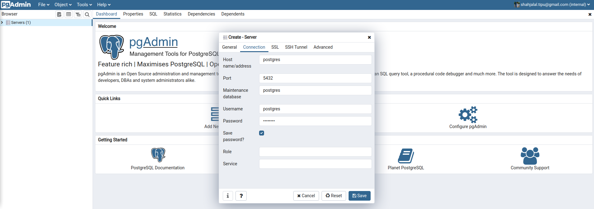
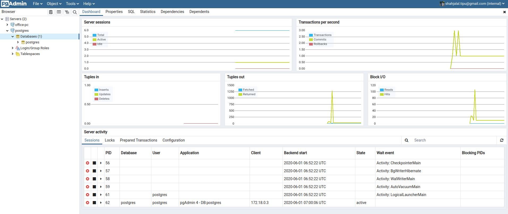

# Install PostgreSQL and pgAdmin4 with Docker

## Setup:

**Create a folder inside cloned repo -**
```
$ mkdir pgadmin4
$ mkdir pg-data
```

**Running the server:**
```
$ docker-compose up -d
```

**Stopping the server:**
```
$ docker-compose down
``` 

Now browse with the browser:

localhost:8888

Login to pgAdmin 4
```
user: shahjalal.tipu@gmail.com
pass: admin1234
```


Connect with the PostgreSQL **Object > Create > Server**

```
Name: postgres
Host name/address: postgress
Port: 5432
Username: postgres
Password: postgres
Save password: [check] 
```



